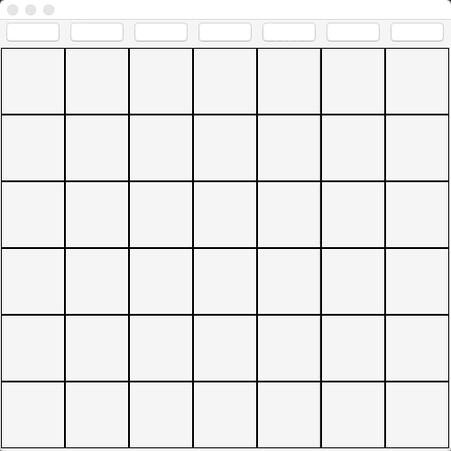

#  
# Connect4

### User Stories

The following depicts the two-player connection board game known as Connect 4. 

### Approach Taken

* Have JButtons serve as input that inserts chip based on selected column
* Simulated gravity by positioning chips based on a "nextRowAvail" decreasing counter array 
* Set up win/lose functions based on the 4 victory methods (horiz/vert/ldiag/rdiag)

### Technologies used

* **Swing** To build IO components
* **Net** To implement (built-in) tools vital to datagram transfer

### Installation Instructions
* Run `SHOW_CONNECT4.java` file as a java application
